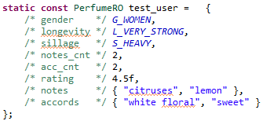
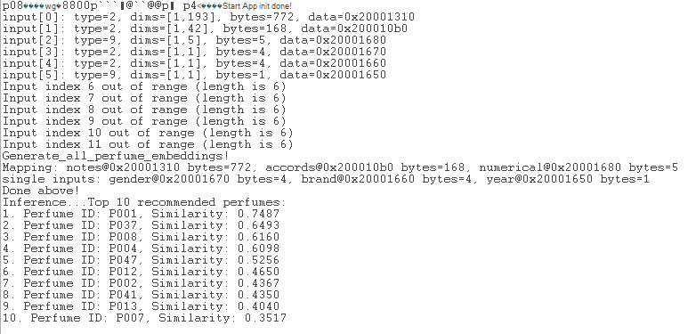

# Perfume Suggestion on EFR32MG24

This repository contains a sample project for a **Perfume Suggestion System** designed to run on the **EFR32MG24** microcontroller. This project is developed for **academic and research purposes** and serves as a practical example for students and researchers interested in on-device AI/ML applications.

## Project Overview

The project leverages an embedded machine learning model to suggest perfumes that align with a user's preferences and needs. The core functionality includes:

  * **User Input**: Collecting customer preferences (e.g., fragrance notes, occasions, mood).
  * **Model Inference**: Running a lightweight AI model on the EFR32MG24 to process the input.
  * **Perfume Suggestion**: Providing a list of suitable perfumes based on the model's output.

The goal is to demonstrate how a complex AI task can be effectively implemented on a resource-constrained embedded system, highlighting the capabilities of the **EFR32MG24** and the **SiLabs SDK**.

This project is built on the Silicon Labs Gecko SDK (SiSDK), leveraging the provided libraries and tools to enable on-device machine learning for the EFR32MG24 SoC.

## Key Features

  * **On-Device AI**: The model runs directly on the microcontroller, eliminating the need for a constant cloud connection.
  * **Efficient Performance**: Optimized to operate within the limited memory and processing power of the EFR32MG24.
  * **Educational Focus**: The codebase is well-commented and structured to be a valuable learning tool for students exploring embedded AI/ML.

-----

## Hardware and Software Requirements

### Hardware

  * **BRD2601B** Thunderboard Sense 2 board (or any other board with the EFR32MG24 wireless SoC).

### Software

  * **SiLabs Simplicity Studio v5**
  * **SiLabs Gecko SDK Suite (GSDK)**: version `2024.12.2`
  * **AI/ML Extension**: `v2.0.1`

-----

## Getting Started

### 1\. Clone the repository

```bash
git clone https://github.com/Hieu-to-900/Perfume_Suggestion_on_EFR32MG24.git
```

### 2\. Open in Simplicity Studio

  * Open Simplicity Studio v5.
  * Navigate to `File > Import > Simplicity Studio Project`.
  * Browse to the cloned repository and select the project file.

### 3\. Build and Flash

  * Ensure your BRD2601B board is connected.
  * Select the correct part number for your device.
  * Click the **Build** button to compile the project.
  * Click the **Flash** button to upload the firmware to the board.

-----

## Demo output
* Input



* Output



## Future Updates
The current machine learning model and dataset are for initial demonstration. We plan to update both the model and the dataset to improve performance and accuracy. These updates are scheduled to be released sometime after October.

## Contribution

This project is a personal example for learning purposes. As such, contributions are not actively sought. However, if you discover any bugs or have suggestions for improvement, feel free to open an issue.

-----

## License

This project is intended for **educational and research use only**. The code is provided as-is without any warranty.

-----

## Disclaimer

This repository contains a sample project that uses code and libraries from the Silicon Labs Gecko SDK (GSDK). All rights and licenses related to the GSDK belong to Silicon Labs. This project is intended for educational purposes and should be used in accordance with the GSDK's Master Software License Agreement (MSLA).